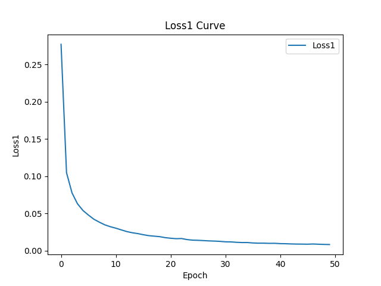
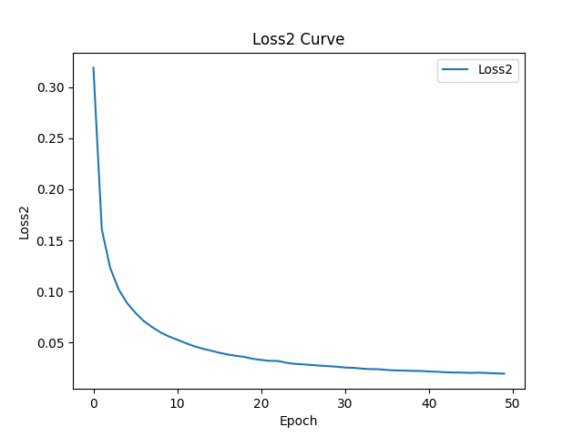
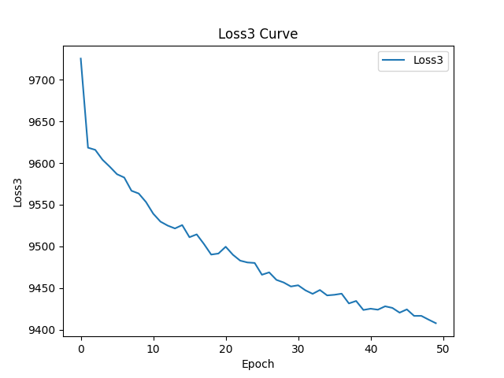
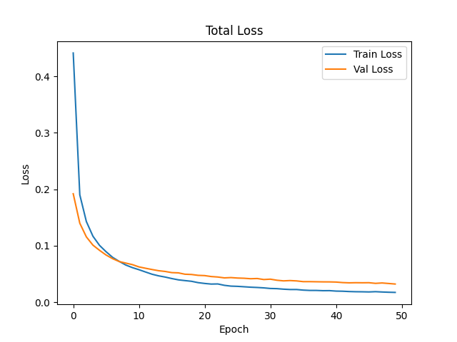
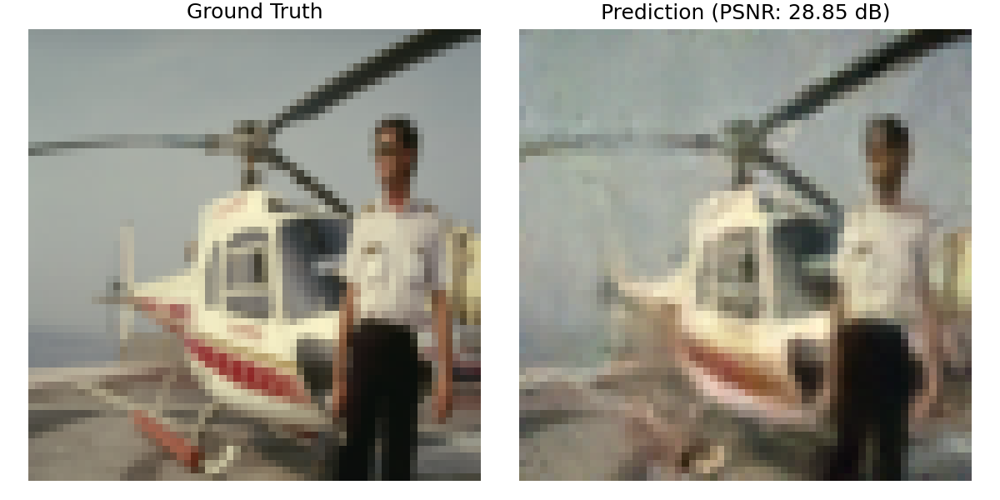
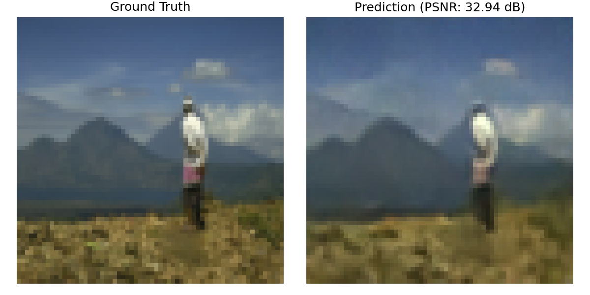

# Compressed Sensing Net (PyTorch)

This project implements a **Compressed Sensing Network (CSNet)** using **PyTorch**. 
The focus is on **compressed sensing for efficient image reconstruction**, a topic relevant to signal processing and machine learning research.
It demonstrates my ability to design and implement deep learning models, manage training pipelines, and visualize results.  
> **Note**: This project was independently implemented by me as part of my deep learning research practice.  

By running `main.py`, the workflow automatically performs **data augmentation, training, testing, and result generation**.

# Multi-Task Learning Optimization Based on Fuzzy Logic

This framework introduces a **multi-task learning (MTL)** approach where multiple task-specific losses are combined into a single composite loss. The method leverages **fuzzy logic** to adaptively balance task weights during training.

---

## 📘 Composite Loss Function

The overall loss is defined as:

\[
\mathscr{L}_{total} = \sum_{i=1}^{k} \mu_i \mathscr{L}_{i}(x, y)
\]

- $\mathscr{L}_{i}(x, y)$ : loss of the *i-th* task  
- $\mu_i$ : adaptive weight of the *i-th* task  
- $k$ : number of tasks  

Weights are constrained as:

\[
\sum_{i=1}^{k} \mu_i = 1
\]

---

## ⚖️ Fuzzy Logic Weighting

To prevent one task from dominating, **fuzzy logic** is applied to adjust $\mu_i$ dynamically.  
The optimization problem is expressed using the Lagrangian:

\[
\mathscr{J}(\mu_i,\lambda) = \sum_{i=1}^k \mu_i^m \mathscr{L}_i - \lambda\left(\sum_{i=1}^k \mu_i - 1\right)
\]

- $\lambda$: Lagrange multiplier  
- $m$: fuzzy weighting exponent  

---

## 🔑 Final Weight Update Rule

By solving the optimization, task weights are obtained as:

\[
\mu_i = \frac{1}{\sum_{l=1}^k \left(\frac{\mathscr{L}_i}{\mathscr{L}_l}\right)^{\frac{1}{m-1}}}
\]

This shows that:  
- Tasks with **higher losses** receive **smaller weights**.  
- Tasks with **lower losses** are emphasized more.  

---

## 🚀 Key Insight
The fuzzy logic framework provides a **dynamic, balanced weighting scheme** that adapts to each task’s learning state, improving training stability and effectiveness.

---

## 📂 Project Structure
```
main.py          # Entry point (data augmentation + training + testing + results)
model.py         # Core model definition (Compressed Sensing Net)
requirements.txt # Dependency list
pyproject.toml   # uv project configuration
uv.lock          # uv lockfile for reproducibility
result/          # Output samples and evaluation results
```

---

## 🚀 Installation

This project uses **[uv](https://github.com/astral-sh/uv)** for Python environment management.

```bash
# Install uv if you don't have it
curl -LsSf https://astral.sh/uv/install.sh | sh

# Create and sync environment
uv sync
```

Alternatively, you can use `requirements.txt`:

```bash
pip install -r requirements.txt
```

---

## 🏃 Usage

Simply run:

```bash
python main.py
```

This will:
- Perform data augmentation
- Train the CSNet model
- Evaluate on the test set
- Save outputs in the `result/` folder
- Generate training curves (loss1, loss2, loss3, total_loss)

---

## 📊 Results

Training loss curves:






Sample reconstructions (from `result/`):

| Example 1 | Example 2 |
|-------|----------------|
|  |  |

---

## 📚 Reference
If you use this work, please reach out for further collaboration, feedback, or inquiries. Your input is highly valued and helps improve the project.

---

## 🔧 Requirements
- Python 3.9+
- PyTorch >= 1.12
- torchvision
- numpy
- matplotlib
